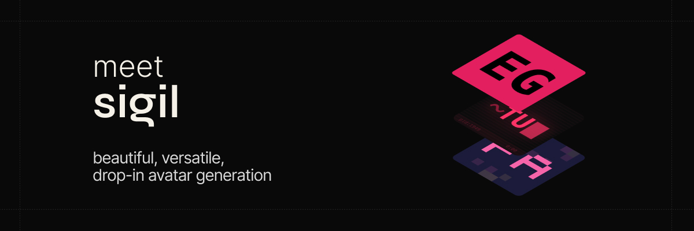
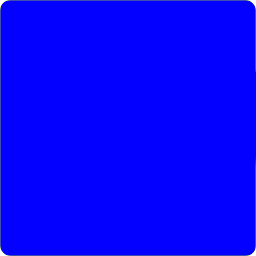
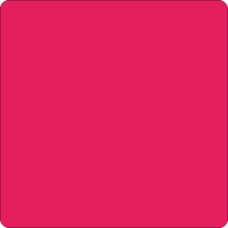
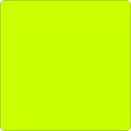
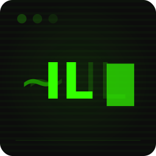

# Sigil



Deterministic, beautiful avatar generation from any name. Eight distinct visual styles — all derived purely from a hash of the input string. No random state, no external services, no images to host.

```
npm: @sigil-ts/core · @sigil-ts/gen · @sigil-ts/react
```

## Styles

| Style         | Preview                                                                                                                                                                                      | Description                                          |
| ------------- | -------------------------------------------------------------------------------------------------------------------------------------------------------------------------------------------- | ---------------------------------------------------- |
| **Bloom**     |                | Blurred orbs, heavy grain, moody atmospheric glow    |
| **Grain**     |                | Film-grain texture via SVG noise, earthy palettes    |
| **Brutalist** |    | Knockout stencil — initials punched through color    |
| **Terminal**  |       | CRT scanlines, phosphor glow, monospace prompts      |
| **Pixel**     |                | Custom 5×5 pixel font, retro gaming palettes         |
| **Ghosts**    |             | Floating ghosts — wavy bottoms, expressive eyes      |
| **Bots**      |                   | Geometric robots — visors, antenna, body panels      |
| **Faces**     |                | Generative abstract faces — eyes, brows, nose, mouth |

## Quick Start

### SVG string (universal JS)

```bash
bun add @sigil-ts/gen
```

```typescript
import { avatar } from '@sigil-ts/gen';

const svg = avatar('Balazs Otakomaiya', { style: 'grain', size: 80 });
// → SVG string ready to inject into DOM or save to file
```

### React component

```bash
bun add @sigil-ts/react
```

```tsx
import { Avatar } from '@sigil-ts/react';

<Avatar name="Balazs Otakomaiya" style="terminal" size={48} />
```

### Core only (build your own renderer)

```bash
bun add @sigil-ts/core
```

```typescript
import { resolve, grainStyle } from '@sigil-ts/core';

// Use the registry
const spec = resolve('Alice Chen', 'grain');

// Or import individual styles for tree-shaking
const spec2 = grainStyle('Alice Chen');
```

**Core is the source of truth.** Each style is a pure function: `(name: string) → StyleSpec`. The spec is a platform-agnostic description of what to draw. Renderers (SVG, future Flutter) are thin translation layers.

## API

### `avatar(name, options?)`

Main entry point from `@sigil-ts/gen`.

| Param           | Type      | Default   | Description                                                                           |
| --------------- | --------- | --------- | ------------------------------------------------------------------------------------- |
| `name`          | `string`  | —         | Name to generate avatar for                                                           |
| `options.style` | `StyleId` | `'grain'` | One of: `grain`, `faces`, `terminal`, `pixel`, `brutalist`, `bots`, `ghosts`, `bloom` |
| `options.size`  | `number`  | `80`      | Output size in pixels                                                                 |

Returns an SVG string.

### `<Avatar />` (React)

| Prop        | Type      | Default   | Description                    |
| ----------- | --------- | --------- | ------------------------------ |
| `name`      | `string`  | —         | Name to generate avatar for    |
| `style`     | `StyleId` | `'grain'` | Avatar style                   |
| `size`      | `number`  | `80`      | Size in pixels                 |
| `className` | `string`  | —         | CSS class for the wrapper span |

## Development

```bash
# Install dependencies
bun install

# Run all tests
bun run test

# Run gallery dev server
cd examples/gallery && bun run dev

# Lint
bun run lint
```

### Versioning & releasing

```bash
# Bump all packages (patch / minor / major / explicit)
bun run version patch     # 0.2.0 → 0.2.1
bun run version minor     # 0.2.0 → 0.3.0
bun run version 1.0.0     # explicit version
```

This bumps all three package.json files, commits as `v{version}`, and creates a git tag. Then:

```bash
git push && git push --tags
```

Create a GitHub Release from the tag to trigger the npm publish workflow.

### Monorepo structure

```
sigil/
├── packages/
│   ├── core/          # Platform-agnostic logic (TypeScript)
│   ├── svg/           # SVG string renderer
│   └── react/         # React component
├── site/              # Landing page (Vite + React)
├── examples/
│   └── gallery/       # Interactive gallery (Bun server)
├── biome.json
└── tsconfig.base.json
```

### Adding a new style

1. Define the spec interface in `packages/core/src/types.ts`
2. Add palettes to `packages/core/src/palettes.ts`
3. Create `packages/core/src/styles/newstyle.ts` — pure function returning the spec
4. Register in `packages/core/src/styles/index.ts`
5. Create `packages/svg/src/renderers/newstyle.ts` — SVG string builder
6. Add to gallery
7. Write tests

## License

MIT
